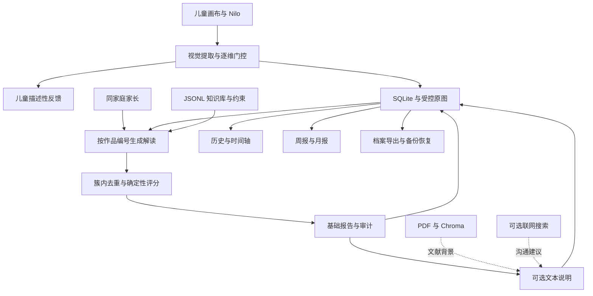

# Luma · 让孩子的想象，被温柔地听见

**孩子和 Nilo 自由画画，家长从真实作品中找到更具体的陪伴方式。**

Luma 是面向家庭的 AI 创作陪伴与成长观察项目，将儿童绘画、作品保存、可追溯解读、亲子沟通建议与周期回顾连成一条完整体验。

<p align="center">
  
</p>

**当前阶段：可运行的家庭创作 MVP。** 支持真实家庭账号、多个孩子、跨设备查看作品、历史解读、周报/月报和档案导出。支付订阅按当前产品决定暂不实现。模型服务需自行配置；本项目没有经过临床有效性验证，报告分值是启发式参考值，不是心理健康概率。

[项目优势](#项目优势) · [功能与体验](#功能与体验) · [快速启动](#快速启动) · [架构](#技术架构) · [验证与边界](#验证与边界) · [文档导航](docs/README.md)

## 项目优势

### 1. 从孩子的创作出发，让家长有内容可聊

Luma 围绕同一幅真实作品连接两端：儿童端以 Nilo 互动、自由画板和画面描述支持表达；家长端提供作品、主题、已有解读与沟通建议。家长可以从“这棵树有什么故事”这样的具体内容开始交流。

水彩场景、角色触摸反馈与画布组成连续的儿童体验。儿童侧使用克制的描述模板，不呈现家长报告；服务端也限制儿童账号访问报告与趋势，角色分工落实到接口权限。

### 2. 解读过程可复核，结果有来源

视觉模型负责提取画面特征；知识库检索和评分由代码执行；文本模型只补充说明。每份正式报告保存知识库版本、命中条目 ID、丢弃原因与冲突记录，便于回看依据、调整规则及复现回归。

仓库包含 **31 条结构化知识条目（26 条实证层、3 条体系层、2 条经验层）**，另有年龄、冲突与输出约束。条目数量代表仓库规模，不等于独立验证样本量。数字画板会排除未实际测量的笔压和擦除次数证据；年龄由家长填写的生日计算。

代码：[特征门控](server/src/services/extractFeatures.js) · [分层调度](server/src/services/kbDispatcher.js) · [评分](server/src/services/score.js) · [知识库校验](knowledge/scripts/validate.mjs)

### 3. 从一次绘画延伸到长期回顾

正式家庭的作品、原图、描述和解读保存在服务端。家长只凭作品编号就能在另一台设备生成或回看历史报告，不依赖儿童设备的临时缓存。一个家庭可以关联多个孩子，切换孩子时请求和页面状态保持隔离。

周报/月报自动汇总已结束周期的作品数、创作天数、常见元素和已有建议，保留来源作品编号。周期回顾不增加模型调用，也不根据数量变化推断心理变化。成长档案可导出为内嵌原图的独立 HTML，离线打开后可用浏览器打印成 PDF；周期摘要另支持 JSON 下载。

代码：[历史](server/src/services/historyService.js) · [周期报告](server/src/services/periodReports.js) · [档案导出](frontend/src/features/parents/exportArchive.ts)

### 4. 核心结果与外部增强分开，故障时有明确反馈

基础报告由本地知识库和确定性规则产生。可选文本说明、文献检索和联网建议受整体等待预算控制，默认 20 秒、最多 30 秒；增强超时或校验失败会保留基础结果。文献与联网内容不会修改评分。

视觉识别失败时会明确报错。过期登录不会悄悄退回游客导致作品漏存；同一图像提交通过幂等键避免重试生成重复记录；正式家庭的空数据、请求失败与游客示例分别显示。

### 5. 部署简单，也考虑作品如何带走和恢复

主服务使用 **Node.js + SQLite + 受控图片目录**，可由一个进程同时托管 API 和前端静态产物。基础评分不要求向量数据库；需要文献背景时再启用独立的 Python / Chroma 检索服务与 embedding 配置。

项目提供内嵌原图与 SHA-256 的备份包、校验后恢复到新目录的恢复脚本、缺图与孤儿文件审计，以及单幅删除和家庭注销。既有备份按保留周期清理，恢复不会覆盖当前数据。

代码：[备份](server/scripts/backup.mjs) · [恢复](server/scripts/restore.mjs) · [家庭数据删除](server/src/services/familyDeletion.js) · [部署指南](docs/部署.md)

## 功能与体验

| 场景 | 当前能力 | 使用边界 |
| --- | --- | --- |
| 儿童创作 | Nilo 互动、自由绘画、图形热身、画笔/橡皮/撤销/清空、PNG 下载 | 当前会话保留草稿；刷新、退出后不保证草稿恢复 |
| 家庭连接 | 家长邮箱账号、孩子昵称与 4 位创作码、家庭邀请码、多孩子切换 | 当前注册模式每个家庭由一个家长创建；未提供第二位家长加入流程 |
| 作品保存 | 完整快照分析、幂等提交、受保护原图、分页历史 | 需儿童正式账号；游客识别不进入家庭档案 |
| 家长解读 | 历史作品选择、生成/回看、证据、建议、审计 | 需同家庭家长权限；视觉特征依赖模型输出质量 |
| 长期观察 | 主题、时间轴、描述性趋势、周报/月报 | 北京时间自然周期；无作品或未结束周期不生成摘要 |
| 数据带走 | 成长册 HTML、浏览器打印 PDF、周期 JSON | HTML 包含已有解读；不会替未解读作品批量调用模型 |
| 数据管理 | 出生日期、单幅删除、密码复核后注销整个家庭 | 注销不立即抹除历史备份、外部服务留存或用户下载件 |
| 文献增强 | PDF 索引、Chroma 检索、引用过滤 | 可选配置，尚需真实模型与索引环境验收 |
| 订阅计划 | 当前开放体验，计划页说明后续安排 | 支付、订单、权益控制未实现，本轮不接入 |

### 三分钟了解产品

1. 从首页进入儿童游客体验，触摸 Nilo、打开画布，试试画笔与图形热身。
2. 配好视觉服务后完成一幅小画，查看画面描述与“想再画点什么吗”的开放反馈。
3. 进入家长游客空间，了解作品、主题和陪伴建议的呈现方式；这里明确使用示例数据。

### 验证真实家庭流程

家长注册并复制邀请码 → 孩子在另一浏览器注册加入 → 完成画作 → 家长打开成长概览的完整解读 → 选择作品生成报告 → 查看创作记录、导出成长档案。

周报/月报只生成已结束周期，不会把刚注册当天的数据伪造成历史摘要。时间边界和补生成行为已通过自动化测试；详细步骤见 [联调说明](docs/联调说明.md)。

## 技术架构



| 层 | 技术 |
| --- | --- |
| 前端 | React 19、TypeScript、Vite 7、Tailwind CSS 4、Framer Motion |
| API / 数据 | Express 4、Node.js 内置 SQLite、scrypt、Bearer 会话与 refresh 轮换 |
| 规则知识 | JSONL、声明式约束、逐维门控、簇内 max、簇间 noisy-OR |
| 可选增强 | 兼容 Chat Completions 的视觉/文本服务、Bocha、Python / LlamaIndex / Chroma |
| 验证 | Vitest、Supertest、Testing Library、jsdom、TypeScript、ESLint |

评分采用启发式公式：`w = min(strength × reliability, 0.9)`，同簇取最大值，再合成 `E = 1 − ∏(1 − w_cluster)`，最后由配置参数映射为参考分值。默认展示上限为 `0.85`，不代表准确率。模型自报置信度只参与特征门控。详见 [RAG 设计](docs/RAG设计.md) 和 [输出标准](docs/情绪判定标准.md)。

## 快速启动

要求 **Node.js 24**；Python 仅为可选文献检索所需。以下命令从仓库根目录执行，Windows PowerShell、macOS / Linux 均可使用 npm 命令。

```bash
npm --prefix server ci
npm --prefix frontend ci
```

复制 `server/.env.example` 为 `server/.env`，填写服务商提供的 `LLM_BASE_URL`、`LLM_API_KEY` 与实际可用的 `LLM_VISION_MODEL`。示例模型名只是配置占位，不保证账号可用；`LLM_TEXT_MODEL` 用于可选说明增强。密钥只放服务端。

两个终端分别运行：

```bash
npm --prefix server start
```

```bash
npm --prefix frontend run dev
```

前端默认 `http://localhost:5173`，通过 Vite 将 `/api` 转发到 `http://localhost:3001`。不配置模型也可以验证认证、界面和游客示例；真实画作识别需要视觉服务。后端图片默认位置相对于运行工作目录，生产建议显式配置绝对 `UPLOAD_DIR`。

```bash
npm --prefix server test
npm --prefix frontend test
npm --prefix frontend run build
npm --prefix frontend run lint
node knowledge/scripts/validate.mjs
```

常用运维命令：

```bash
npm --prefix server run reports
npm --prefix server run backup
node server/scripts/media-audit.mjs
node server/scripts/restore.mjs /备份文件.sqlite /不存在的恢复目录
```

更多配置：[部署](docs/部署.md) · [文献 RAG](rag/README.md) · [API 契约](docs/API契约.md)

## 验证与边界

本轮覆盖账号隔离、幂等提交、异常请求、历史回看、年龄门控、跨孩子响应、周期边界、注销回滚和备份恢复等路径。测试使用临时数据库与服务替身，没有改动真实家庭数据。最新数量和执行环境见 [功能完成度](docs/功能完成度.md)。

尚未完成真实设备触控、旋转与打印版式验收，也未实测视觉/文本模型、搜索、embedding 和生产部署。当前构建仍有较大资源体积提示；既有依赖安全通告尚未全部修补。工程测试不能证明模型识别准确率、临床有效性或商业转化率。

项目的长期价值方向是家庭持续陪伴与可回看的创作档案。Family / Premium 属于后续商业规划；当前不把价格、付费转化、长期记忆或多轮推理作为已交付能力宣传。

## 文档与目录

```text
frontend/     双端界面、账号状态、画布、报告与档案导出
server/       API、认证、知识库评分、周期报告、备份与恢复
knowledge/    结构化条目、约束和校验工具
rag/          可选 PDF 索引与检索
scripts/      本地启动辅助
 deploy/      Caddy、systemd、备份计划示例
 docs/        当前说明、设计记录与研究草稿
```

从 [文档导航](docs/README.md) 开始。当前功能以 [功能完成度](docs/功能完成度.md)、[交互流程](docs/交互流程.md)、[项目边界](docs/项目边界.md) 和代码为准；历史计划与文献摘录保留研究过程，不作为当前功能承诺。
