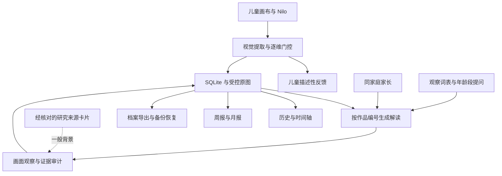

# Luma · 让孩子的想象，被温柔地听见

**孩子和 Nilo 自由画画，家长从真实作品中找到更具体的陪伴方式。**

Luma 是面向家庭的 AI 创作陪伴与成长观察项目，将儿童绘画、作品保存、可追溯解读、亲子沟通建议与周期回顾连成一条完整体验。

<p align="center">
  
</p>

**当前阶段：可运行的家庭创作 MVP，目标年龄 5–12 岁。** 支持真实家庭账号、多个孩子、跨设备查看作品、画面观察报告、周报/月报和档案导出。支付订阅按当前产品决定暂不实现。模型服务需自行配置；画面观察不构成心理筛查或诊断。旧版启发式分值仅留在历史报告中。

[项目优势](#项目优势) · [功能与体验](#功能与体验) · [快速启动](#快速启动) · [架构](#技术架构) · [验证与边界](#验证与边界) · [文档导航](docs/README.md)

## 项目优势

### 1. 从孩子的创作出发，让家长有内容可聊

Luma 围绕同一幅真实作品连接两端：儿童端以 Nilo 互动、自由画板和画面描述支持表达；家长端提供作品、主题、已有解读与沟通建议。家长可以从“这棵树有什么故事”这样的具体内容开始交流。

水彩场景、角色触摸反馈与画布组成连续的儿童体验。儿童侧使用克制的描述模板，不呈现家长报告；服务端也限制儿童账号访问报告与趋势，角色分工落实到接口权限。

### 2. 画面观察可复核，研究背景有来源

视觉模型提取可见元素、颜色与位置；服务端按观察词表生成画面描述，按 5–7、8–9、10–12 岁调整开放式亲子提问的措辞。报告保留观察证据 ID、模型识别结果和版本，供家长回看。研究文献以经核对的来源卡片独立展示，说明研究任务、适用局限并链接原文，不参与单幅画的判断。

原有 31 条房—树—人等解释规则已逐条登记于审计清单，并退出新报告链路。任务、年龄和测量方式与自由数字绘画不一致的内容，不会自动转换为个人解释。已核对的研究文献仍作为一般背景呈现，未完成原文核对的 PDF 保留为待研究资产。

代码：[视觉提取](server/src/services/extractFeatures.js) · [观察报告](server/src/services/observationReport.js) · [文献背景](server/src/services/literatureContext.js) · [知识库校验](knowledge/scripts/validate.mjs)

### 3. 从一次绘画延伸到长期回顾

正式家庭的作品、原图、描述和解读保存在服务端。家长只凭作品编号就能在另一台设备生成或回看历史报告，不依赖儿童设备的临时缓存。一个家庭可以关联多个孩子，切换孩子时请求和页面状态保持隔离。

周报/月报自动汇总已结束周期的作品数、创作天数、常见元素和已有建议，保留来源作品编号。周期回顾不增加模型调用，也不根据数量变化推断心理变化。成长档案可导出为内嵌原图的独立 HTML，离线打开后可用浏览器打印成 PDF；周期摘要另支持 JSON 下载。

代码：[历史](server/src/services/historyService.js) · [周期报告](server/src/services/periodReports.js) · [档案导出](frontend/src/features/parents/exportArchive.ts)

### 4. 观察结果与研究背景分开，故障时有明确反馈

报告由可见画面特征、本地观察词表和亲子对话建议产生；经核对的文献背景以固定来源卡片附在报告中，不需要 Python 或向量索引。原始 PDF 的语义检索保留为离线研究工具，目前不接入新报告。

视觉识别失败时会明确报错。过期登录不会悄悄退回游客导致作品漏存；同一图像提交通过幂等键避免重试生成重复记录；正式家庭的空数据、请求失败与游客示例分别显示。

### 5. 部署简单，也考虑作品如何带走和恢复

主服务使用 **Node.js + SQLite + 受控图片目录**，可由一个进程同时托管 API 和前端静态产物。画面观察与经核对的文献背景均不要求向量数据库。

项目提供内嵌原图与 SHA-256 的备份包、校验后恢复到新目录的恢复脚本、缺图与孤儿文件审计，以及单幅删除和家庭注销。既有备份按保留周期清理，恢复不会覆盖当前数据。

代码：[备份](server/scripts/backup.mjs) · [恢复](server/scripts/restore.mjs) · [家庭数据删除](server/src/services/familyDeletion.js) · [部署指南](docs/部署.md)

## 功能与体验

| 场景 | 当前能力 | 使用边界 |
| --- | --- | --- |
| 儿童创作 | Nilo 互动、自由绘画、图形热身、画笔/橡皮/撤销/清空、PNG 下载 | 当前标签页暂存草稿，刷新可选择恢复；正式作品仍需主动保存 |
| Nilo 共创 | 灰色参考底图、SVG 与 PNG 选图、移动缩放、圈选及明确授权的基础修改、分别撤销 | 330 份可用 SVG 与 368 张 PNG；167 个具体题材各有新增初级、中级 PNG。新增参考不提交为儿童笔迹，目录外图形仍受复杂度限制 |
| 语音交流 | 中英文语音、打断、可选连续对话、字幕与按钮；语音控件集中底部，顶部背景音乐在语音期间自动降低音量 | 默认浏览器识别与朗读，能力因设备而异；可选云语音需独立启用和配置，生产麦克风需 HTTPS |
| 家庭连接 | 家长邮箱账号、孩子昵称与 4 位创作码、家庭邀请码、多孩子切换 | 当前注册模式每个家庭由一个家长创建；未提供第二位家长加入流程 |
| 作品保存 | 作品与完整笔迹文档、幂等提交、来源记录、分页历史、重开后分别撤销 | 实际协助修改后保留作品与过程，跳过自主特征分析；旧作品来源未知时不生成成长分析，游客记录保存在本机 |
| 家长观察 | 历史作品选择、生成/回看、可见证据、亲子提问、文献背景、审计 | 需同家庭家长权限；适用 5–12 岁；视觉特征依赖模型输出质量 |
| 长期回顾 | 主题、时间轴、周报/月报 | 北京时间自然周期；无作品或未结束周期不生成摘要；不推断心理趋势 |
| 数据带走 | 成长册 HTML、浏览器打印 PDF、周期 JSON | HTML 包含已有解读；不会替未解读作品批量调用模型 |
| 数据管理 | 出生日期、单幅删除、密码复核后注销整个家庭 | 注销不立即抹除历史备份、外部服务留存或用户下载件 |
| 研究背景 | 已核对来源卡片、原文链接和适用局限 | 只作一般背景；原始 PDF RAG 为离线研究工具，不参与新报告 |
| 订阅计划 | 当前开放体验，计划页说明后续安排 | 支付、订单、权益控制未实现，本轮不接入 |

### 三分钟了解产品

1. 从首页进入儿童游客体验，触摸 Nilo、打开画布，试试画笔与图形热身。
2. 配好视觉服务后完成一幅小画，查看画面描述与“想再画点什么吗”的开放反馈。
3. 进入家长游客空间，了解作品、主题和陪伴建议的呈现方式；这里明确使用示例数据。

### 和 Nilo 一起创作

首次进入画布即可选择自己画或一起画，打开历史作品时直接续画。左侧工具栏默认收起，切换时保持画布尺寸、位置和笔迹比例。背景音乐位于顶部；Nilo、麦克风、声音和连续对话开关位于底部。点 Nilo 交出绘画回合，不自动开启麦克风；回应是否朗读取决于声音开关。孩子自行选择描画的颜色、笔刷和粗细。换图、清除参考、圈选、撤销、清空与保存等操作集中在画布周围。

孩子先画或讲故事 → 主动邀请 Nilo → Nilo 根据画面和孩子的原话提出小主意 → 显示灰色参考底图 → 孩子移动、缩放、描画，或点击“换一个”“清除底图”。SVG 使用虚线，PNG 使用浅灰参考图并支持查看原图。“换一个”按具体题材提供图片选择，记录孩子实际选择的画风。底图不写入保存、下载或分析的笔迹图；继续画可保留底图，正在等待的旧请求会失效。

目录中可使用审核通过的 SVG 和独立 PNG 参考，孩子不必知道风格名称。目录外事物可由模型规划有复杂度上限的轮廓、曲线和细节，仍以独立底图呈现；不承诺任意写实图像或整幅复杂插画都能生成。素材清单、审核与偏好规则见 [Nilo 素材说明](knowledge/nilo/README.md)。

语音与共创模式独立。麦克风需要主动开启；“小一点”“换成蓝色”等明确短指令可在本地处理。新增图案呈现为虚线底图，供孩子描画；明确授权的基础修改可作用于选中的已有笔迹，并可撤销。连续语音每段最多 20 秒、每次会话最多 5 分钟或 12 轮，离开页面或停止即释放录音。只保留每个孩子、每幅作品的简短故事主题和提案偏好，不在本地持久化完整对话或录音。

配置与验收：[Nilo API / 语音服务](server/NILO_API.md) · [联调与验收](docs/联调说明.md)。当前默认使用浏览器识别和朗读，示例中的 `VOICE_ASR_ENABLED`、`VOICE_TTS_ENABLED` 均为 `false`；无需本地语音模型或云语音密钥。朗读优先选取设备可用的同语种童声，没有时使用较轻柔的音色；声音随设备而异。可选云端 TTS 保留阿里百炼 Mochi（沙小弥）童真男声接入，需要单独启用和配置服务端密钥，当前不默认开启。

### 验证真实家庭流程

家长注册并复制邀请码 → 孩子在另一浏览器注册加入 → 完成画作 → 家长打开成长概览的完整解读 → 选择作品生成报告 → 查看创作记录、导出成长档案。

周报/月报只生成已结束周期，不会把刚注册当天的数据伪造成历史摘要。时间边界和补生成行为已通过自动化测试；详细步骤见 [联调说明](docs/联调说明.md)。

## 技术架构



| 层 | 技术 |
| --- | --- |
| 前端 | React 19、TypeScript、Vite 7、Tailwind CSS 4、Framer Motion |
| API / 数据 | Express 4、Node.js 内置 SQLite、scrypt、Bearer 会话与 refresh 轮换 |
| 观察知识 | JSON 观察词表、年龄段亲子提问、来源卡片及旧规则审计 |
| 模型与离线研究 | 兼容 Chat Completions 的视觉服务；Python / Chroma 用于离线 PDF 检索 |
| 验证 | Vitest、Supertest、Testing Library、jsdom、TypeScript、ESLint |

旧版启发式评分实现和历史记录保留供审计；新报告不计算心理分值。规则退役原因、来源核对状态与新旧报告差异见 [心理知识资产](knowledge/psychology/README.md)。

## 快速启动

要求 **Node.js 24**；Python 仅为离线 PDF 研究检索所需。以下命令从仓库根目录执行，Windows PowerShell、macOS / Linux 均可使用 npm 命令。

```bash
npm --prefix server ci
npm --prefix frontend ci
```

复制 `server/.env.example` 为 `server/.env`，填写服务商提供的 `LLM_BASE_URL`、`LLM_API_KEY` 与实际可用的 `LLM_VISION_MODEL`。示例模型名只是配置占位，不保证账号可用；`LLM_TEXT_MODEL` 用于 Nilo 文本交流与家长沟通卡片的措辞生成。家长卡片按作品缓存，文本生成失败时使用有来源的分龄模板。密钥只放服务端。

两个终端分别运行；前端命令会同时启动官网、家长端和儿童端：

```bash
npm --prefix server run dev
```

```bash
npm --prefix frontend run dev
```

官网默认 `http://localhost:5173`，家长端为 `http://localhost:5174`，儿童端为 `http://localhost:5175`；三个前端均通过 Vite 将 `/api` 转发到 `http://localhost:3001`。后端 `dev` 会在源码变更后自动重启，避免前端已更新、API 仍运行旧版本；生产启动继续使用 `npm --prefix server start`。如只需调试单端，可分别运行 `dev:portal`、`dev:parent` 或 `dev:child`。不配置模型也可以验证认证、界面和游客示例；真实画作识别需要视觉服务。后端图片默认位置相对于运行工作目录，生产建议显式配置绝对 `UPLOAD_DIR`。

```bash
npm --prefix server test
npm --prefix frontend test
npm --prefix frontend run build
npm --prefix frontend run lint
node knowledge/scripts/validate.mjs
```

常用运维命令：

```bash
npm --prefix server run reports
npm --prefix server run backup
node server/scripts/media-audit.mjs
node server/scripts/restore.mjs /备份文件.sqlite /不存在的恢复目录
```

更多配置：[部署](docs/部署.md) · [文献 RAG](rag/README.md) · [API 契约](docs/API契约.md)

## 验证与边界

自动化检查覆盖账号隔离、幂等提交、异常请求、历史回看、年龄门控、跨孩子响应、周期边界、注销回滚、备份恢复、共创确认及语音状态等路径。测试使用临时数据库与服务替身。运行命令和人工验收步骤统一见 [联调说明](docs/联调说明.md)，结果以当前运行输出为准。

真实设备触控、方向锁定、儿童语音、打印、模型质量及生产部署需要在目标环境单独验收。当前构建仍有较大资源体积提示；依赖安全状态应以部署时的审计结果为准。工程测试不能证明模型识别准确率、临床有效性或商业转化率。

项目的长期价值方向是家庭持续陪伴与可回看的创作档案。Family / Premium 属于后续商业规划；当前提供的是有限故事记忆和短上下文对话，不把商业转化或长期成长效果作为已验证结果。

## 文档与目录

```text
frontend/     双端界面、账号状态、画布、报告与档案导出
server/       API、认证、画面观察报告、周期报告、备份与恢复
knowledge/    心理研究与解读规则、Nilo 绘画知识、参考素材和校验工具
rag/          可选 PDF 索引与检索
scripts/      本地启动辅助
deploy/      Caddy、systemd、备份计划示例
docs/        功能流程、技术契约、部署与联调验收
```

从 [文档导航](docs/README.md) 开始。当前能力、操作流程和限制统一见 [功能与使用流程](docs/功能与使用流程.md)；研究文献、心理规则与绘画素材见 [知识资产目录](knowledge/README.md)。已被实现替代的阶段计划和重复记录可从 Git 历史查阅。
