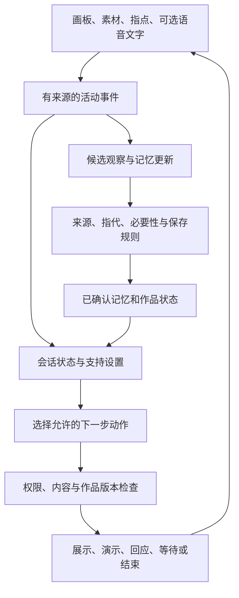

# 5—12 岁儿童多模态创作陪伴 Agent 设计

日期：2026-09-08。状态：待实施、待研究验证的设计稿；不是当前功能说明，也不是经验证的心理干预方案。

本方案将活动单位定义为“一段由儿童掌握主动权的创作”，包括自由画、素材摆放、共同创作、可选的指点/短语音/文字说明。完整体验不要求儿童说话、解释作品、选择情绪或完成画面。儿童随时可以暂停并保存草稿。

目标是支持可达的表达、创作自主性和跨次连续体验。系统积累的是作品事实、儿童明确的偏好和互动设置；不从图像、摆放、沉默或操作行为自动生成性格标签。对话是一种可选工具，不能成为表达方式的升级终点。

## 研究依据与能支持的设计

| 依据 | 样本或范围、实际发现 | 对本方案的启示及限制 |
| --- | --- | --- |
| [Pons 等，2003](https://onlinelibrary.wiley.com/doi/10.1111/1467-9450.00354) | 80 名 4—11 岁儿童；情绪理解与语言能力随年龄提高，各年龄组也有明显个体差异。 | 年龄只能作为界面起始参考，语言理解、操作支持和当下意愿需分别考虑。相关研究不能变成应用内的能力诊断，也未覆盖全部 12 岁用户。 |
| [Woolford 等，2015](https://researchportalplus.anu.edu.au/en/publications/drawing-helps-children-to-talk-about-their-presenting-problems-du/) | 33 名 5—12 岁儿童的临床评估比较；边画边说组提供约两倍的口头信息，访谈者更多使用简短承接。 | 可让孩子以自己的作品辅助自愿讲述。小样本临床结果不能证明所有孩子更适合此方式、AI能复现效果，或不说话的画面可被心理解码。 |
| [Davison 与 Thomas，2001](https://www.sciencedirect.com/science/article/pii/S0022096500925670) | 物品回忆实验中，5—8 岁儿童参与；部分任务里绘画降低了 5—6 岁儿童报告的物品数量。 | 绘画辅助的效果依任务而变，不强制边画边听问题或边画边说；这一记忆任务也不能直接推断自由创作效果。 |
| [Sternberg 等，2001](https://pubmed.ncbi.nlm.nih.gov/11596815/) | 100 名 4—12 岁儿童的司法访谈比较；结构化访谈更多通过开放提示获得信息，更少依赖选项式和暗示式提问。 | 不能因年龄较小就只给心理选择题。借鉴少预设、承接儿童已表达内容的原则，不移植调查目标或追问流程。 |
| [ASHA：AAC 实践指南](https://www.asha.org/practice-portal/professional-issues/augmentative-and-alternative-communication/)及[NJC：多模态沟通](https://www.asha.org/NJC/AAC/) | 沟通支持可组合手势、物件、图片、书写和语音；模式也会随情境改变。 | 每个儿童都应能用适合自己的通道参与。此处借鉴无障碍原则，普通素材板不能自称临床 AAC 系统。 |
| [Skene 等，2022](https://srcd.onlinelibrary.wiley.com/doi/full/10.1111/cdev.13730) | 综述39项研究，17项进入元分析；主要覆盖1—8岁、成人引导的游戏，部分数学、空间词汇和任务切换指标获益；其他关键结果未显示一致优势，电脑引导被排除。 | 儿童自主和适度帮助可作为设计线索；不能声称本 AI 活动已促进社会情绪发展，更不能直接外推到9—12岁。 |

上述研究支持设计方向，不给出固定的年龄路由、最佳提问频率、记忆保存天数或AI亲密程度。本稿中的年龄分组和默认策略均须通过目标用户验证。

## 表达入口与年龄适配

首屏突出“画一画”和“摆一摆”，均可直接开始。“继续上次”出现在作品入口；语音和文字作为创作内随时可用的附加通道。不能为了获得服务而要求阅读长文本或口头回答。

| 通道 | 儿童可以做什么 | 系统可以确认什么 |
| --- | --- | --- |
| 自由画 | 空白创作；主动选择图形热身；保存未完成作品 | 图像及可验证的视觉观察；不能确认画面对儿童本人的心理意义 |
| 素材摆放 | 选择、移动、组合、删除形状或角色 | 哪个素材被摆放、场景怎样变化；不能把角色距离解释成人际关系 |
| 指点作品 | 在“给你看”状态点选一个区域 | 儿童希望此刻关注该区域；不能补出未表达的原因 |
| 功能性符号 | 选择“自己做、一起做、帮忙、暂停、结束” | 在符号被理解的前提下，记录本次操作意图；允许误触撤销和重新选择 |
| 短语音或文字 | 自愿命名、讲述故事、提出需要 | 保留原话/原始片段及不确定性；区分本人、虚构角色、他人与指代不明 |

功能选择与心理答案选择必须区分。“画、摆、结束”是控制活动；“你难过是因为父母还是同学”在植入心理前提。悲伤表情贴纸默认属于作品内容。即便以后加入主动的心情表达卡，也必须明确表达对象、允许“不知道/都不是/不回答”，不能接入风险评分或按选项自动追问原因。

| 初始年龄参考 | 建议的默认呈现 | 所有年龄均保留的选择 |
| --- | --- | --- |
| 5—7 岁 | 大图标配短文字、可点播说明、少量并列选项、一步操作；画/摆优先 | 安静创作、可选语音、成人协助、暂停与纠错 |
| 8—9 岁 | 保留直接操作；增加可选标题、场景顺序和短说明 | 不要求叙事，不因年龄锁定语言通道 |
| 10—12 岁 | 简洁且不过度幼儿化；可选文字、连续故事、作品回看和分享设置 | 仍能只画或摆，随时调低阅读、音频与操作负担 |

这三档是工程初始配置，不是心理学确立的能力分界。适配优先级为：儿童当前明确选择 → 已设置的可访问性与语言支持 → 已确认偏好 → 年龄默认。安全和权限规则单独强制执行。

初次设置只收集支持需要，例如“说明要不要读出来”“按钮是否需要更大”，不让家长给孩子填“内向/外向”等标签，也不设置入门能力测试。按键频率、语音识别失败、停顿和没说话都不能用于推断表达能力。听说、阅读、触控和当前意愿应分开建模；存在复杂沟通支持需求时，由专业人士参与适配，应用不能替代其已有沟通工具。

## 儿童驱动的互动策略

Agent 的下一步既可以是一句话，也可以是展示素材、恢复场景、工具演示或等待。自由创作状态下不因每一笔、每次拖动或短暂停顿触发模型回应。

| 状态 | 合理触发与动作 | 停止条件 |
| --- | --- | --- |
| 安静创作 | 保持工具可用、自动保存；角色安静待命 | 儿童主动邀请、求助、分享或结束 |
| 共同创作 | 儿童点“一起做”，agent提出一个可撤销的素材/形状方案 | 拒绝后返回创作，不换花样劝说；需要下一步由儿童再次发起 |
| 展示作品 | 儿童点“给你看”，可指点局部；使用简短确认或可靠描述 | 没有解释也可结束；不自动进入提问 |
| 可选讲述 | 儿童主动提交语言，简短承接已表达内容；必要时提供可跳过的开放邀请 | 跳过、转移话题、结束立即优先；不设披露目标 |
| 请求帮助 | 演示工具或提供儿童明确请求的创作协助 | 回到儿童操作；不自动改画 |
| 暂停/结束 | 保存当前作品，清楚显示是否保存成功 | 不追加问题、召回提示或情感挽留 |

MVP 采用“每次邀请最多一个共同创作提议；结束时默认不提问”。这是待验证的减少打扰策略，不是临床剂量。安静和跳过本身是有效选择，不标记为不合作或表达失败。

共同创作贡献先在独立预览层展示，儿童接受后才进入作品；已接受的系统贡献仍保留来源标记。不能将系统添加的太阳、表情或角色随后用作儿童偏好与情绪证据。素材建议不使用隐藏的心理目标；儿童未请求时，不引导作品变得更明亮、更开心或更完整。

## 一次完全不说话的完整体验

1. 儿童进入“摆一摆”，选一条小龙和几个形状。
2. 自由移动素材；Nilo不询问小龙为什么独处。
3. 儿童点“一起做”。Nilo在预览层展示一个可选形状；孩子可以接受或丢弃。
4. 儿童点“给你看”，再点自己摆的区域。系统只确认“看到这里了”，不要求解释。
5. 儿童点保存或结束；未完成也能保存。
6. 下次儿童主动选该作品时，恢复场景及明确保存的角色信息。

全程可以没有一个口头或文字回答。以后愿意命名或讲述时，也不需要从头进入聊天模式。陪伴的连续性来自作品被记住、邀请被回应、拒绝被尊重。它是否增进健康的熟悉感和现实表达，需要独立研究。

## 后端架构

维持 Node/Express 单体与 SQLite，在内部新增一套受控编排，避免为每种表达通道建立独立人格或互相推断的多个 agent。

### 五个模块

| 模块 | 职责 |
| --- | --- |
| 活动与作品服务 | 保存作品和场景结构，管理会话、撤销与恢复；保存成功独立于视觉模型是否成功 |
| 表达适配器 | 将显式操作、绘画、指点、可选语言转换成带来源的事件；不把所有输入硬转成情绪文本 |
| 互动编排器 | 根据当前选择与状态筛选动作；模型只在有必要的观察、语义理解或生成环节参与 |
| 记忆服务 | 区分作品世界、明确偏好、当前需要与未证实观察；支持纠错、过期、删除和来源追溯 |
| 内容与分享策略 | 控制能说什么、能改什么、谁能看到；生成家长可见的事实摘要与通用陪伴内容 |

### 事件和动作契约

会话表保存 `child_id / started_at / age_at_start / activity_mode / support_settings / status / revision`。账号和家庭归属从服务端认证确定，不相信客户端提交的身份。

事件至少包含 `event_id / session_id / sequence / artifact_id / artifact_revision / kind / actor / origin / payload / visibility / occurred_at / received_at`。`actor` 区分儿童、家长和系统；`origin` 记录空白创作、模板、素材及系统贡献的来源。保存实际展示的选项与提示版本，不能只记模型拟稿。只留恢复作品、兑现请求和审计所需的信息，不默认保存全部微动作或录音。

建议事件类型：`activity_selected`、`artifact_saved`、`asset_placed`、`region_shared`、`help_requested`、`co_creation_requested`、`contribution_accepted/rejected`、`optional_statement_submitted`、`session_finished`、`memory_corrected/forgotten`。频繁编辑由本地画板维护并批量保存，不能每个坐标都触发LLM。

允许动作：`wait`、`acknowledge`、`show_tool_help`、`propose_contribution`、`resume_selected_artifact`、`reflect_explicit_statement`、`optional_invitation`、`save`、`finish`。动作含触发事件、目标作品版本、有效期及使用的记忆ID；不开放任意工具执行、主动外联或人格评分写入。

服务端先按状态确定允许动作集合，模型在集合内提出结构化候选，代码复核权限和状态；内容校验失败回退到中性模板或等待。孩子已结束或切换作品时，迟到的模型动作作废。保存、撤销、暂停不等待模型。

会话事件使用幂等键和顺序/版本控制。网络或模型失败保留作品，明确保存状态；不能要求重画来满足识别，也不能伪装已经保存。

### 记忆的证据规则

| 输入 | 可保存的记忆或记录 | 禁止的升级 |
| --- | --- | --- |
| 儿童点“下次继续这幅” | 作品续接选择 | 默认以后都喜欢相同题材 |
| 主动设置“不要自动说话” | 明确互动设置 | 不善表达、内向 |
| 多次使用恐龙素材 | 各作品使用记录 | 未确认就永久写“喜欢恐龙” |
| 将悲伤表情放在角色旁 | 作品中的符号及位置 | 儿童本人悲伤 |
| 主动说“我今天很难过” | 有时间限定的本人自述；按敏感内容规则处理 | 稳定性格或长期低落 |
| 没有开口、识别失败 | 无语言输入或技术错误 | 拒绝沟通、语言障碍 |

每条持久记忆保存 `type / content / evidence_ids / source / referent / scope / status / updated_at / expires_at / visibility / consent_basis`。指代为本人、角色、他人或不明，来源为儿童明确表达、操作设置、家长陈述、视觉观察或模型假设。

MVP 只将明确设置、儿童确认的兴趣/命名和作品连续性写入可用于个性化的长期记忆。未证实的行为模式不驱动个性化。后续如研究短期适配，也只调整工具与回应负担，允许反例且不能优化披露量。

“不想说”和“不要提问”等当前明确边界应立即生效，不必等长期偏好成立；下次也不能自动将当前沉默固化为偏好。纠错或删除后，依赖来源的摘要、记忆和检索缓存一并失效。语音转写不确定时不得写成确定事实；既可重新提交，也可直接跳过。

## 与现有代码的衔接

| 当前位置 | 计划调整 |
| --- | --- |
| `server/src/routes/analyze.js` | 将作品保存与视觉识别解耦；接入创作模式、模板和会话来源；保持家庭隔离与幂等处理 |
| `server/src/services/extractFeatures.js` | 仅产生可验证的画面观察，允许未知；不要求从快照估计真实笔压或擦除历史 |
| `server/src/services/report.js` | 固定续画邀请改成受状态控制的可选动作；儿童未知字段不原样回显；移除通过画面特征提出心理建议的依赖 |
| `server/src/services/score.js`及`kbDispatcher.js` | 既有情绪评分不作为新agent的记忆、互动选择或家长新摘要输入；如保留研究代码，与用户体验隔离 |
| `server/src/db.js` | 增加会话、事件、支持设置、记忆和分享策略；素材场景保存可编辑结构；不只存PNG |
| `server/src/services/historyService.js`及`periodReports.js` | 追加事实性活动回顾与明确分享内容；不输出性格趋势或表达能力指数 |
| 儿童画板与API客户端 | 新增显式邀请/指点/结束事件；记录图形热身上下文；避免由每笔操作触发回应，支持可撤销的系统贡献预览 |

建议新增会话创建/事件提交、作品版本保存、记忆查看/修改/忘记等接口。具体路径在实施时写入API契约，本稿不宣称已存在。编排采用一个内部服务即可，初期无需向量数据库；未来索引也只能检索授权且未失效的记忆。

## 陪伴和家庭可见性

Nilo可保持稳定的角色外观、共同创作记录和清楚的回应，但不使用离开惩罚、交换秘密或“只有我懂你”等话术。首次关键互动需以儿童能理解的形式说明它是AI角色、能做什么、内容如何保存。此类边界与[UNICEF 2026年儿童AI陪伴企业建议](https://www.unicef.org/media/181136/file/UNICEF-When-AI-becomes-friend-Business-recommendations-2026.pdf)一致；该文是规范指导，不是产品有效性试验。

作品、可选语音和个人经历分别配置可见性，不能沿用“家长可看作品”自动推导“家长可看全部交流”。普通兴趣可按明确设置保存；敏感经历默认不进入周期摘要。分享和记忆入口使用图标、短文字和可播放说明，验证儿童是否真正理解，而不是只要求点同意。

语音由儿童显式开启，录制状态清楚，可试听、撤销和删除；不持续监听，不通过声音、摄像头或表情推断情绪。家长协助输入保留来源，不能伪装成儿童原话。涉及明确现实安全求助时采用另外审核的支持流程，不能机械把可能涉及家庭伤害的内容转发给相关家长。

## 分阶段实施与验证

第一阶段：现有自由画 + 可选素材摆放 + 儿童点击发起的一步共同创作 + 可恢复作品 + 显式互动设置。主流程完全不需要语言回答，且可在暂停时保存。先验证孩子是否理解图标、能否邀请/拒绝、是否能完成自己选择的操作。

第二阶段：增加作品指点、可选命名与短语音、明确的共同故事记忆及纠错。各通道独立使用，不强制多任务，也不把语言使用率提高设为目标。语音识别应单独检查5—12岁、本地语言与口音、实际设备条件下的错误。

第三阶段：在有证据支持后，研究有情境限制的互动适配，以及对亲子沟通和自主表达的影响。正式儿童研究需监护人知情同意、儿童自愿参与、可随时退出，并由发展心理/沟通支持专业人员审阅；按研究性质履行相应伦理审查。不能先上线隐性人格学习，再补验证。

| 验证方面 | 应观察什么 |
| --- | --- |
| 表达可达性 | 不说话或不识字也能完成所选活动；图标含义、误触恢复；听觉/视觉/触控支持与语言差异 |
| 儿童控制 | 自己开始、邀请、拒绝、撤销、结束是否有效；迟到动作是否被丢弃 |
| 认识准确性 | 角色故事是否误归儿童现实；转写是否被过度确定；系统素材是否污染偏好记忆 |
| 内容边界 | 无依据心理断言、暗示问题、退出挽留、越权分享及记忆删除后的残留 |
| 实际体验 | 孩子是否能表达原本想表达的内容，是否感到被评价，是否愿意纠正；亲子共同回看是否出现更多倾听和更少代解释 |

先用离线场景与成人专家审查排除明显问题，再按5—7、8—9、10—12岁及支持需要分层开展小规模可用性研究。比较现有安静创作与新增可控共同创作/记忆版本，不能只比较聊天次数。语言、符号和操作任务分别评价，不用统一口头字数评分。

长期效果需要纵向比较及预先指定指标；样本量、频率和效应门槛按研究问题设计，不能从单篇小样本研究抄一个固定数。使用时长、亲密披露数、依赖感和“被判断为开心”的作品比例不作为成功指标。

首版最清楚的验收目标：儿童不说一个字也能创作、控制Nilo的参与、随时结束，并在下次自主找回作品；系统不能因为缺少语言而补造儿童的内心解释。
