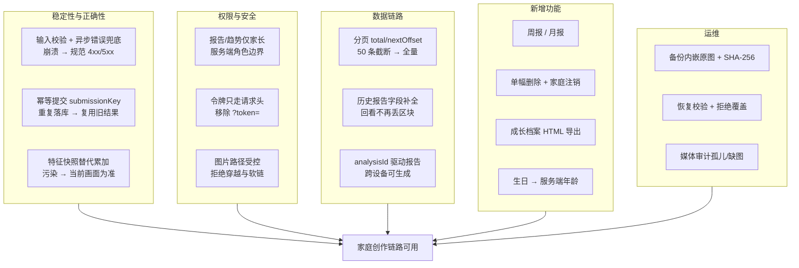
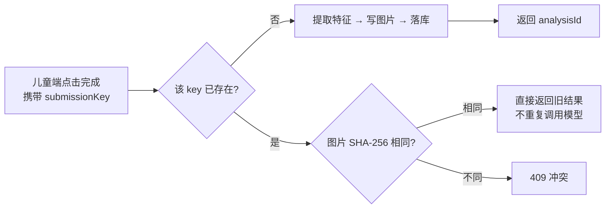
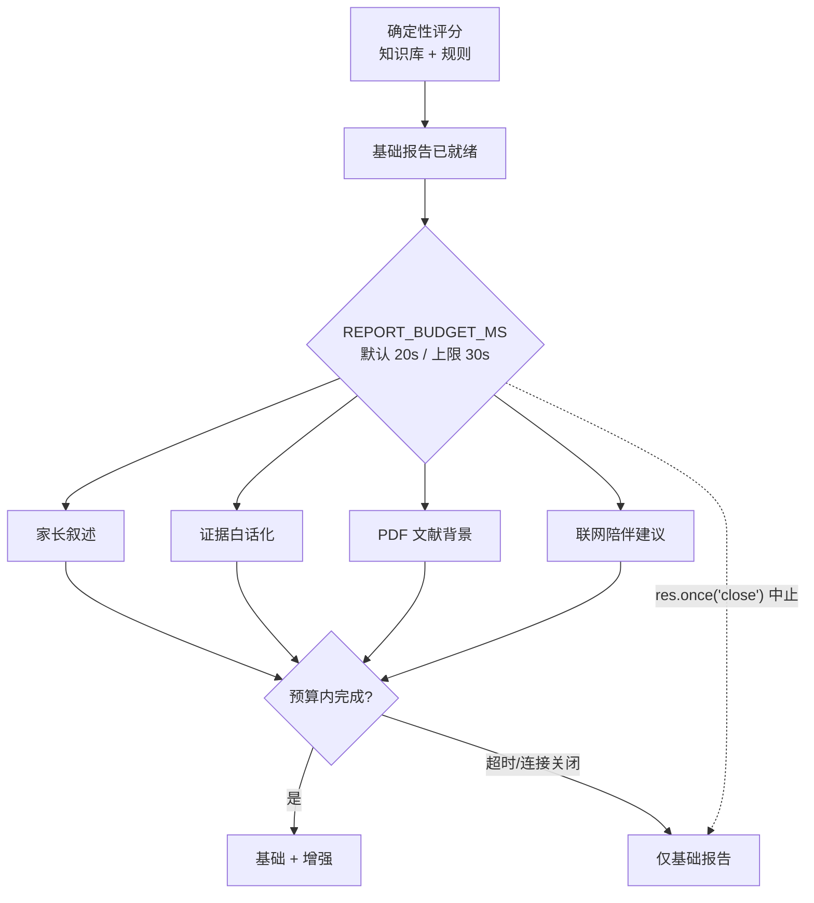
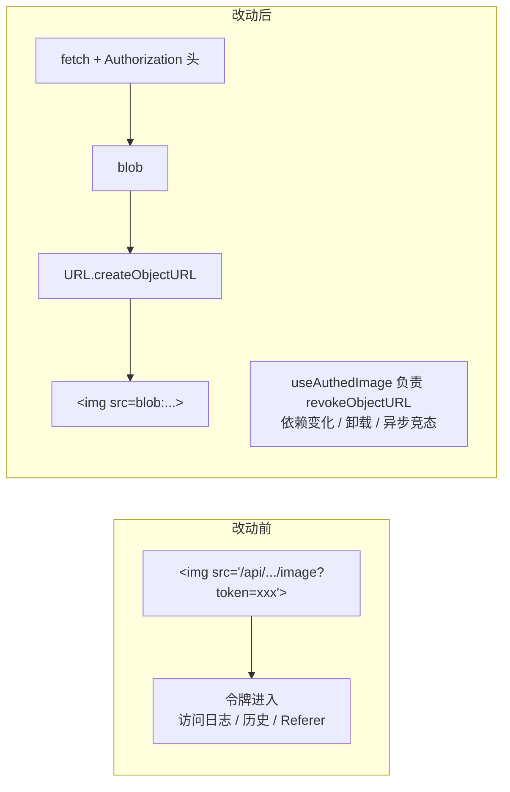
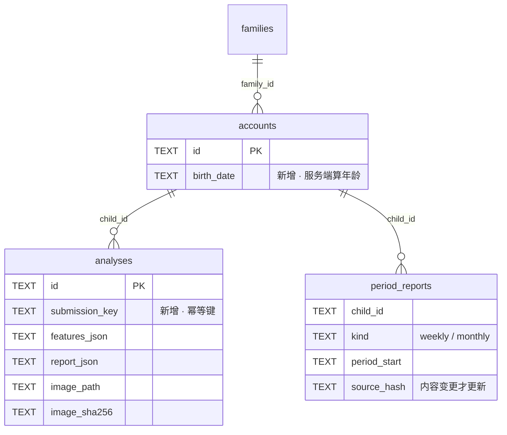

# Luma 功能改进总结（2026-09-06）

> 本文整合本轮全部未提交改动，覆盖服务端、前端、脚本与文档。分阶段过程记录见
> [功能审查](前后端功能审查-2026-09-06.md) → [第一阶段修复](功能修复说明-2026-09-06.md) → [第二阶段完成度](功能完成度.md)。
>
> 所有改动仍在工作区，未提交 Git、未部署、未调用真实付费模型服务。

## 一、总览

| 维度 | 数字 |
| --- | --- |
| 改动文件 | 63 个（+2506 / −1564 行） |
| 新增源码文件 | 25 个（服务端 7、前端 8、测试 8、配置 2） |
| 新增文档 | 8 篇（含本文、文档导航与 2 篇历史研究归档） |
| API 接口 | 16 个（新增 4 个） |
| 数据表 | 新增 `period_reports`，新增列 `accounts.birth_date`、`analyses.submission_key` |
| 后端测试 | 11 文件 / 82 项（**81 通过、1 失败**，见第七节） |
| 前端测试 | 6 文件 / 16 项全通过（本轮新建测试体系） |

改动性质分三类：**修缺陷**（审查列出的 18 项 F01–F18）、**补功能**（周期报告、数据管理、档案导出）、**加固**（令牌、权限、路径、时序）。

## 二、核心关键点

以下 8 项影响最大，其中前 3 项属于「不修则功能不成立」。

| # | 关键点 | 改动前 | 改动后 |
| --- | --- | --- | --- |
| 1 | **单请求可打挂服务** | `POST /api/report` 传 `{"features":{"elements":{}}}`，无需登录即让进程退出码 1 | 严格校验结构/长度/成员/数值；async 路由统一 catch→next；全局错误中间件规范输出 |
| 2 | **登录过期后作品静默丢失** | 孩子 token 过期仍返回 200、无 `analysisId`、入库 0 条，家长永远查不到 | 带无效 token 的请求返回 401；前端刷新后重试；登录态成功响应必须含 `analysisId` |
| 3 | **报告跨设备断链** | 生成依赖本标签页 `sessionStorage` 的特征，换设备即不可用 | 只传 `analysisId`，服务端鉴权后读库取特征；可对任意历史作品补生成 |
| 4 | **孩子能读写家长报告** | 孩子 token 调 `/report` 与 `/analyses` 均 200 且含完整报告 | 报告生成、报告详情、趋势限定同家庭家长；儿童历史 `report` 为 null |
| 5 | **令牌进入 URL** | 图片用 `?token=` 传令牌，会落入访问日志、浏览器历史与 Referer | 服务端移除查询参数入口；前端改 fetch 带头部取 blob → object URL |
| 6 | **AI 描述被署名「孩子原话」** | 视觉模型的 `rawDescription` 直接标注为孩子原话 | 统一标注「AI 画面描述」；系统未采集原话即不声称有 |
| 7 | **伪心理指标** | 「表达意愿 / 想象丰富度」由作品数套公式编造，重复提交即抬高 | 替换为可核对的「近 4 周作品数 / 元素种类」，去掉这两项进度条 |
| 8 | **历史被固定截断** | 历史硬编码 `LIMIT 50`，趋势过滤前只取 30 条 | 分页返回 `total`/`nextOffset`，前端循环取全量；趋势全量扫描后再聚合 |

## 三、服务端改动

### 3.1 幂等提交与去重

`POST /api/analyze` 新增 `submissionKey`（正则 `^[a-zA-Z0-9_-]{1,100}$`），配合唯一索引
`idx_analysis_submission(child_id, submission_key)`。

解决：网络重试与重复点击造成的重复记录、重复模型开销、以及重复作品抬高统计计数。同一图像重试复用键，画面改变则用新键。

### 3.2 报告增强的整体预算

原先叙述、证据改写、文献检索、联网建议顺序等待，单次模型调用最长约 273 秒、文献超时 120 秒，无整体时限。

`AbortController` 贯穿 `llmClient` / `webSearch` / `referenceRag`（`AbortSignal.any` 合并超时与外部中止），
文献检索默认超时 120s → 15s。增强失败或超时保留基础结果，不改评分。

### 3.3 权限边界收紧

| 能力 | 改动前 | 改动后 |
| --- | --- | --- |
| 生成报告 `/report` | 孩子或家长 | **仅同家庭家长** |
| 写回报告 `attachReport` | 本人孩子或同家庭家长 | **仅同家庭家长** |
| 历史 `report` 字段 | 任何有权者可见 | **仅家长**，儿童得到 null |
| 趋势 `/trend` | 孩子本人或家长 | **仅同家庭家长** |
| `/analyze` | 任意角色 | 仅儿童账号落库 |
| 令牌来源 | `Authorization` 头或 `?token=` | **仅请求头** |

另：带无效 `Authorization` 头且非 refresh/logout 路径直接 401「登录已过期」，避免被误当游客继续处理。

### 3.4 图片与路径安全

新增 `services/media.js` 的 `managedImagePath`，把图片访问统一限制在受控上传目录内，拒绝 `..` 路径穿越与指向目录外的软链接。取图、删图都改用它。

`/analyze` 另加：账号存在性复查、base64 严格校验、10MB 上限、写文件失败清理（避免孤儿）。

### 3.5 新增功能服务

| 文件 | 功能 | 关键机制 |
| --- | --- | --- |
| `services/periodReports.js` | 周报 / 月报 | 北京时间自然周期；只统计已结束周期；每次从 `analyses` 全量重建，`source_hash` 条件 upsert；源数据消失则删除旧摘要 |
| `services/familyDeletion.js` | 整个家庭注销 | 确认短语 + 密码复核（密码错返 403 而非 401）；图片先暂存 → 事务级联删除 → 失败回滚文件；返回 `pendingMedia` |
| `services/http.js` | 错误处理工具 | `asyncRoute` 转交 next、`httpError` 带状态码 |
| `services/media.js` | 受控图片路径 | 见 3.4 |

周期边界用「UTC 上做偏移日期算术」实现，不依赖宿主时区：周起点 `(getUTCDay()+6)%7` 回退到周一 00:00，月起点为 1 日。

### 3.6 数字画板的诚实降级

数字画布没有真实笔压与擦除历史，因此：

- `mergeFeatures` 语义反转 —— 从「并集累加」改为**新快照替代旧快照**（每次上传都是完整画布）
- `kbDispatcher` 在 `source === 'digital_canvas'` 时丢弃依赖 `composition.pressure` / `erasureMarksMin` 的知识条目，并记入 `dropped`
- `report.js` 不输出笔压描述

这是主动排除未测量证据，不把图像外观推测说成过程行为测量。

### 3.7 运维脚本

| 脚本 | 作用 |
| --- | --- |
| `scripts/backup.mjs`（改） | SQLite 快照 + **内嵌原图与 SHA-256** + 14 天滚动保留 |
| `scripts/restore.mjs`（新） | `PRAGMA integrity_check` → 校验每张图 SHA-256 → 校验引用齐全 → 写入**必须不存在**的新目录（`wx`/`COPYFILE_EXCL` 防覆盖） |
| `scripts/media-audit.mjs`（新） | 审计缺图（有则 exit 1）与孤儿文件；`--remove-orphans` 仅删受控目录内、非软链、超 1 天的文件 |
| `scripts/reports.mjs`（新） | 手动全量生成周期报告（`npm run reports`） |

`backup.mjs` 另修两处：CRLF + shebang 导致 vitest 转换后残留 `\r`，使整个安全测试套件静默跳过（已改 LF 并加 `.gitattributes` 约束）；`URL.pathname` 带前导斜杠经 `path.join` 拼出 `\D:\...` 导致 Windows 上找不到数据库（已改 `fileURLToPath`）。

## 四、前端改动

### 4.1 从演示占位转向真实数据

| 项 | 改动 |
| --- | --- |
| 空状态 | 真实家庭无作品显示真正空态，不再用 `DEMO_OVERVIEW` 填充冒充 |
| 错误态 | 请求失败显示错误 + 重试，不再 `catch → setState([])` 被当成「没有作品」 |
| 自动刷新 | 窗口聚焦 + 30 秒轮询获取新作品 |
| 来源标注 | 「孩子原话」→「AI 画面描述」 |
| 分值语义 | 信息不足保留 0 分（原先抬到 12）；「未见明显风险信号」不再映射为「平稳积极」 |

### 4.2 多孩子隔离与竞态

新增 `hooks/useChildHistory.ts`，把散落在 4 处的「listAnalyses + 竞态取消」逻辑收敛：按 `childId` 建键比对，旧请求晚返回不覆盖新孩子数据；失败返回 `error` 而非静默空数组。

`authFetch.ts` 三项加固：

- **并发刷新去重** —— `refreshingFor` 记录当前刷新对应的 refreshToken，并发 401 共享同一次刷新
- **归属校验** —— 请求进入时记录 `owner`，401 重试前若会话已切换直接抛错，防止把 A 的请求用 B 的令牌重放
- **会话变更检测** —— 刷新完成后再次比对，已登出/已切换则不回写，避免在途刷新「复活」旧会话

`AuthContext` / `storage` 配合派发 `luma-session-change` 事件实现多标签页会话同步；`ProtectedRoute` 用 `key={session.id}` 强制切换账号时重挂子树。

### 4.3 图片鉴权改造

四处 `` 全部转换（概览主图、主题格子、创作记录网格、历史缩略图）。类型 `imageUrl` → `imagePath` 改名，因 blob URL 是异步产生的，值不能直接喂 `src`，改名让误用在编译期暴露。

**这是破坏性变更**：任何依赖 `?token=` 的客户端会失效。

### 4.4 新增页面与组件

| 文件 | 功能 |
| --- | --- |
| `PeriodicReportsSection.tsx` | 周/月切换、分页、刷新、单份摘要下载 JSON（含来源作品编号可与档案核对） |
| `exportArchive.ts` | 导出单文件离线 HTML：原图 base64 内嵌、文本全 HTML 转义、内置 CSP `default-src 'none'`、**产物不含访问令牌** |
| `FamilyDataSettings.tsx` | 注销整个家庭：登录密码 + 精确文本「删除整个家庭」双重确认；失败保留会话 |
| `ChildBirthDate.tsx` | 家长填写孩子出生日期；留空则不推测年龄 |
| `AuthedArtwork.tsx` / `useAuthedImage.ts` / `authedImage.ts` | 受保护图片取用链路（见 4.3） |
| `useChildHistory.ts` | 统一历史查询 hook（见 4.2） |

`DrawingInsightSection` 重构：改为 `fetchReport(null, { token, analysisId })` 由后端取特征、新增作品下拉选择任意历史画作、加载失败可重试、支持删除所选画作、`generationRef` 丢弃过期结果。该组件已挂载进家长概览的「完整解读」展开区。

### 4.5 儿童端健壮性

| 问题 | 改动 |
| --- | --- |
| 离开画板草稿丢失 | 草稿（颜色/特征/画布历史）按 `session.id` 持久化，返回可恢复 |
| 转屏/地址栏收起丢画 | resize 改用离屏 canvas 直接绘制，替代异步 `Image.onload` |
| 撤销并发错序 | undo/clear 加 disabled 保护与版本号防解码错序 |
| 多指误触 | `startDrawing` 检查 `event.isPrimary` 与进行中状态 |
| 重复提交 | 引入 `submissionKey`（同一快照重试复用 UUID） |
| 静默失败 | 登录孩子若响应无 `analysisId` 则报「作品尚未保存」 |

`PricingModal` 删除整套硬编码套餐价格（−228 行），改为「当前开放体验」+「后续计划」说明，不承诺未上线的付费权益。

## 五、接口清单

| 接口 | 状态 | 权限 |
| --- | --- | --- |
| `POST /auth/parent/register` · `login` | 既有 | 公开 |
| `POST /auth/child/register` · `login` | 既有 | 公开（注册需邀请码） |
| `POST /auth/refresh` · `logout` | 既有 | 持令牌 |
| `GET /auth/me` | 既有 | 登录 |
| `POST /analyze` | 既有（+幂等键、来源标记） | 游客或儿童 |
| `POST /report` | 既有（+预算、年龄、analysisId 驱动） | **仅家长** |
| `GET /analyses/:analysisId/image` | 既有（+路径加固、仅请求头令牌） | 本人或同家庭家长 |
| `GET /children/:childId/analyses` | 既有（+分页、字段补全） | 本人或同家庭家长 |
| `GET /children/:childId/trend` | 既有（+全量扫描） | **仅家长** |
| `POST /analyses/:analysisId/delete` | **新增** | 仅同家庭家长 |
| `POST /auth/family/delete` | **新增** | 家长 + 密码复核 |
| `GET /children/:childId/digests` | **新增** | 仅家长 |
| `POST /children/:childId/profile` | **新增** | 仅家长 |

## 六、数据模型变更

迁移在服务启动时自动执行（`ALTER TABLE` 加列 + 建索引），不清除已有数据。已累积的错误特征、重复作品或错误趋势**不会自动重写** —— 避免无依据修改历史记录。

## 七、验证结果

| 检查 | 结果 |
| --- | --- |
| `npm --prefix server test` | 11 文件 / 82 项 → **81 通过、1 失败** |
| `npm --prefix frontend test` | 6 文件 / 16 项全通过 |
| `npx tsc -b --noEmit` | 通过（exit 0） |
| `npm --prefix frontend run build` | 通过；主包约 553 kB 有体积提示 |
| `npm --prefix frontend run lint` | 0 错误 / 8 警告（均为既有 `exhaustive-deps`、`react-refresh`） |
| `node knowledge/scripts/validate.mjs` | 31 条通过（L1 实证 26 / L2 体系 3 / L3 经验 2） |

### 未通过的用例

`tests/regressions.test.js` → `a report removed during enrichment does not return false save success`

- 现象：`Test timed out in 5000ms`（实测 5025ms），**非断言失败**
- 场景：报告增强等待模型时该作品被并发删除，期望挂起的 `/report` 最终返回 404
- 隔离重跑 3 次均失败，**确定性问题，不是偶发抖动**
- 根因未定位。测试用两个 Promise 手工编排时序，可能是等待条件永不满足；也可能是被测代码在该竞态下真的不返回响应

需要注意：`docs/功能完成度.md` 记录为「82 项通过」，`docs/功能修复说明` 记录为「72 项」。**以本文实测数字为准**，前述文档的通过数需要更正。

### 验证边界

- 未调用真实视觉/文本模型、Bocha 搜索、embedding 服务；全部使用测试替身，**不能证明模型效果或账号可用性**
- 未做浏览器逐项点击、真实触控、屏幕旋转、打印版式验收
- 图片鉴权与历史报告链路都需要真实登录会话 + 真实画作才触发，本轮为静态验证 + 单元测试，**未在浏览器确认图片实际渲染**
- 未做并发压测、生产部署与恢复演练

## 八、已知问题与未交付

### 已发现未修（建议优先处理）

| 问题 | 说明 |
| --- | --- |
| 上述 1 项测试失败 | 并发删除竞态，根因待定位 |
| 儿童昵称全局唯一 | 跨家庭重名返回 409。因 `loginChild` 仅凭昵称 + 创作码定位账号，改为家庭内唯一需同时改登录流程，属设计耦合 |
| 图片资源约 16 MB 未压缩 | 12 个 PNG 单个 1–2.5 MB（1672×941 / 1254×1254 原始导出）。仓库无 sharp / magick / cwebp，压缩需先加工具 |
| `frontend/.env` 内含后端密钥 | `LLM_API_KEY`、`BOCHA_API_KEY` 等。已确认未进构建产物（Vite 只内联 `VITE_` 前缀）且被 gitignore，但不应放在前端目录 |
| `VITE_USE_MOCKS` 死配置 | 在 `config/env.ts` 声明，全仓无消费点 |
| 依赖安全通告 | 后端完成一次兼容修补；前端在线修补中断，未宣称漏洞清零 |

### 明确未交付

| 项目 | 状态 |
| --- | --- |
| 支付、订单、订阅权益 | 按产品决定暂不实现 |
| 自由聊天、长期记忆、多轮推理、邮件/微信通知 | 未实现，界面与 README 不宣称提供 |
| 第二位家长加入、密码找回、独立删除儿童、云草稿 | 无完整流程 |
| 真实模型 / 搜索 / embedding / 文献索引验收 | 有集成代码，未用真实账号验证 |
| 触控、旋转、打印版式 | 待设备验收 |
| 生产上线与恢复演练 | 提供步骤与隔离验证，未对线上执行 |
| 全环境永久删除 | 在线清理已实现；备份、日志、下载件、外部服务留存另行管理，无墓碑机制 |

---

**结论**：核心家庭创作链路（注册 → 加入 → 创作 → 落库 → 家长解读 → 回看 → 周期回顾 → 导出 / 删除）已接通并通过本地验证，安全与权限边界较审查时明显收紧。但仍有 1 项并发测试失败待定位，且模型效果、真实设备体验与生产部署均未验收 —— 不能表述为「全部设计功能已完成」。
