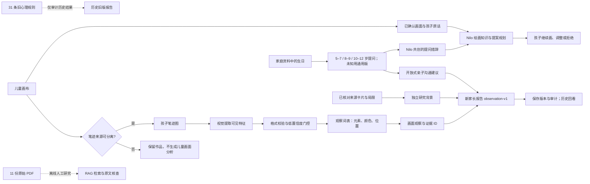

# 儿童心理研究与画作观察知识资产

本目录保存 Luma 与儿童绘画、心理研究有关的**文献、历史规则、逐条审计和检索配置**。它不是一套可直接给儿童做心理测评的量表。Luma 面向 5–12 岁家庭，目前提供的是基于孩子画作的**可见内容观察与亲子沟通入口**：帮助家长注意到画面中有什么，并把解释作品的主动权交还给孩子。

这套设计保留了心理研究的价值，也区分了“研究背景”“某项研究中的统计关联”和“对一个孩子的判断”。文献可以帮助我们设计边界、提出值得研究的问题；未经目标人群、绘画任务和产品场景验证的符号规则，不会因为写入知识库就自动成为个人结论。

## 心理知识库在产品中的实际使用流程



虚线分支不进入 `observation-v1` 的判断链。图中的“年龄分层”只改变提问措辞，“研究背景”不与画面符号配对。Nilo 共创另从同一[沟通词库](../child-development/conversation.json)读取年龄措辞指引：登录孩子的年龄段由服务端根据生日计算，游客与生日未知时使用通用版；它不限定能画的主题、画法或提案大小。

1. 儿童画作先进入 [`/api/analyze`](../../server/src/routes/analyze.js)，视觉模型给出可见元素、颜色、物体位置等候选特征；服务端校验格式与范围，并丢弃低置信度维度。模型描述和自报置信度都不等于经过校准的心理测量。看不清、未在词表内的内容可以留为空白，不强行命名。
2. 家长通过 [`/api/report`](../../server/src/routes/analyze.js) 生成 `observation-v1` 报告。[观察词表](../observation/catalog.json)只支持元素、颜色及有有效物体边界框时的大致位置，不把“树”“黑色”“画在角落”等细节转换为情绪、人格或风险标签。报告保留可见证据 ID；证据不足时明确标记 `insufficient`。接口中的 `confidence: 0` 只是旧客户端兼容占位值，不是识图准确率或心理分数。
3. [沟通词库](../child-development/conversation.json)按 **5–7、8–9、10–12 岁**调整家长提问的语言：从简短具体的故事问题，逐步转向创作过程和孩子自己的表达选择。正式家庭报告的年龄来自资料中的生日；生日未知时使用通用提问，已知年龄超出 5–12 岁时不生成新报告。年龄分层不改变画面证据，也不是绘画能力常模。
4. 报告另附 [`literature/curated-context.json`](literature/curated-context.json) 的中英文**研究背景卡片**。每张卡片提供原文链接、核对范围、研究对象与任务、概括和局限。卡片与具体画面特征不匹配，不参与判断或评分。当前三条卡片中，一条只核对到出版方摘要；其审核程度在数据中明示。
5. 共创作品的成长分析使用可分离的**孩子笔迹**，不把 Nilo 画的部分当作孩子独立表达；报告也提示互动可能影响孩子的创作选择。家长端按版本区分新观察与历史旧版报告，旧报告保留供回看，但不会自动重算为新结论。

## 心理规则的设计取舍

早期系统把房—树—人等画面特征写成 31 条结构化规则：L1 26 条、L2 3 条、L3 2 条，包含特征匹配、冲突处理、权重和参考分值。这套实现便于工程复现与回溯，却不能仅凭规则数量或确定性公式证明它适用于 **5–12 岁儿童的自由数字绘画**。原研究可能使用指定任务、不同年龄或样本；部分旧规则引用只有来源线索，尚未完成原文逐条核对。数字画布也不能从静态图片可靠恢复真实笔压、擦改次数或创作动机。

因此，31 条规则已在 [`rules/audit.json`](rules/audit.json) **逐条登记并全部退出新家长报告**。旧条目、约束、调度器和评分代码保留用于解释历史结果、核查错误与研究迭代，不作为现行产品的心理判断引擎。审计记录了每条规则的原始来源文字、候选文献、任务与年龄适用性、数字画布测量问题和待核对字段；空值表示尚无证据，不能按常识填补。

| 考虑的问题 | 当前处理方式 | 对家长和产品的价值 |
| --- | --- | --- |
| 单幅画容易被过度解释 | 只描述可见内容，不输出心理倾向、诊断或风险概率 | 家长得到具体的交流起点，减少“一个符号决定孩子状态”的误读 |
| 5 岁与 12 岁的交流方式不同 | 三个年龄段分别设计开放问题，生日未知时回退通用问题 | 提问更适合孩子表达，同时不按年龄给作品打分 |
| 模型可能看错或看不清 | 校验特征、逐维门控，无法确认时明确说明不足 | 不把猜测包装成确定事实，方便家长结合孩子的讲述核对 |
| 不同绘画任务和人群不可直接互推 | 文献卡片记录研究对象、任务差异和局限；旧规则保留审核状态 | 有研究出处，也能看清出处**能支持什么、不能支持什么** |
| 共创与独立创作来源不同 | 分析孩子笔迹，标记共创来源及互动影响 | 不把 AI 贡献误记成孩子的心理或发展证据 |
| 历史结果与新语义不同 | 保存旧报告原貌并明确标为历史版本；新报告保存观察版本和证据 ID | 跨设备回看时可区分版本，不悄悄改写家长曾看到的内容 |
| 研究材料会持续增加 | 原始 PDF、候选引用、人工核对卡片和运行词表分开管理 | 新资料可以先入档审阅，不会自动进入面向家庭的判断链路 |

这些是**产品与工程上的可追溯性、审慎表达和版本管理优势**，不是临床有效性、识图准确率或改善亲子关系的效果证明。孩子自己的故事和日常情境仍比模型对单幅画的猜测重要。

## 目录与文件分工

| 位置 | 保存的内容 | 当前使用状态 |
| --- | --- | --- |
| [`rules/entries.jsonl`](rules/entries.jsonl) | 31 条历史心理特征规则及原有来源线索 | 不进入新家长报告；用于旧结果解释和审计 |
| [`rules/audit.json`](rules/audit.json) | 每条规则的退役状态、来源核查和适用性待办 | 知识治理依据；校验脚本检查 31 条均有记录 |
| [`rules/constraints.json`](rules/constraints.json)、[`rules/dispatch.config.json`](rules/dispatch.config.json) | 历史年龄、冲突、输出和分层调度配置 | 遗留配置，不是新观察报告的运行规则 |
| [`references/`](references/) | 11 份本地研究 PDF 原件 | 研究档案与离线检索输入；不能仅凭文件存在宣称结论已验证 |
| [`literature/catalog.json`](literature/catalog.json) | PDF 稳定 ID、文件名、SHA-256、审核与许可状态、检索候选开关 | 原件清单；`retrievalAllowed` 不等于许可或全文审核通过 |
| [`literature/rule-source-map.json`](literature/rule-source-map.json) | 31 条旧规则与本地 PDF 的**候选**对应关系 | 字面线索，不是文献支持关系；已审阅关系需附页码、摘录和审阅记录 |
| [`literature/curated-context.json`](literature/curated-context.json) | 已核对的来源卡片、中英文概括、适用局限与原文链接 | 新报告直接读取，用于一般研究背景，不按画面召回 |
| [`literature/README.md`](literature/README.md) | 文献入库、引用关系和审核字段的说明 | 资料维护规范 |
| [`retrieval/config.json`](retrieval/config.json)、[`retrieval/eval-cases.json`](retrieval/eval-cases.json) | 离线 PDF 检索参数与 4 个固定验收问题 | 研究检索评估；不参与当前新报告 |
| [`scripts/validate-literature.mjs`](scripts/validate-literature.mjs) | 核验 PDF 文件及哈希、规则映射和审核字段 | 资料变更后的完整性检查 |
| [历史规则说明](rules/README.md) | 旧匹配、调度、评分数据与代码入口 | 阅读旧报告或维护遗留测试时使用 |
| [创作对话证据](../child-development/evidence.md) | 已核对的交流与儿童 AI 设计来源、年龄分层和共创的证据缺口 | 设计研究入口，不直接读入模型 |

**运行词表放在相邻的知识目录**：[`../observation/`](../observation/README.md) 保存新报告可见内容词表， [`../child-development/`](../child-development/README.md) 保存年龄分层沟通文案。独立的 [`../../rag/`](../../rag/README.md) 保存 Python 索引与检索程序；其生成的 `knowledge/psychology/chroma/` 是本地索引缓存，不是研究原件，也不随新报告在线检索。旧规则代码位于 `server/src/services/`；新报告入口和文献装配分别见 [`observationReport.js`](../../server/src/services/observationReport.js)、[`literatureContext.js`](../../server/src/services/literatureContext.js)。

## 文献如何进入产品

本地 11 份 PDF 与报告中的三条来源卡片是**两种不同的审核集合**。`catalog.json` 主要确认本地原件及哈希，很多书目信息、许可和全文审查仍待补全；`curated-context.json` 记录已经针对指定章节或出版方摘要核对过、且适合以局限说明形式呈现的内容。即使某篇研究卡片已进入报告，也不代表它支持任意一条旧规则。尤其不能用同作者的综述替代规则引用的单项研究，或用二手指南替代原始研究。

**当前文献足以支撑审慎的产品边界，不足以证明整个流程的有效性。** 三条报告卡片说明 HTP 研究与自由绘画的任务差异、相反证据及临床筛查的要求；[创作对话证据表](../child-development/evidence.md)另收录绘画讲述、引导式游戏和儿童 AI 的原始来源与局限。这些都没有直接验证 Nilo 的三档提问、AI 共创质量或家长报告效果。下一步应按年龄、语言、画风和共创来源做真实许可样本评测，分别报告识图错误、无依据推断、孩子拒答体验和提案相关性；涉及心理筛查主张还需独立的目标人群效度研究。

| 想要主张的能力 | 当前证据状态 | 上线前还需验证什么 |
| --- | --- | --- |
| “能描述画里看得见的内容” | 有可追踪词表、门控和接口测试；尚无充分真实画作准确率评测 | 多年龄、多语言、多画风标注集；分别报告识别、位置、拒答和来源错误 |
| “提问适合不同年龄” | 三档措辞已接入家长报告及 Nilo；分界与文案仍是产品设计假设 | 儿童可理解性、提问是否打断创作、拒答体验、文化和语言差异 |
| “Nilo 与孩子有效共创” | 有画布预览、贡献来源、几何约束与代码回归；未证实长期效果 | 真实儿童参与的提案相关性、孩子自主感、误识别后的修正和退出体验 |
| “能做心理筛查或预测” | **没有足够证据，产品不提供该能力** | 另行定义临床用途、参照标准、目标人群效度及专业与伦理审阅 |

评测应事先固定样本来源、标注定义和年龄组，再报告总体及分组结果；失败案例与相反证据同样保留。代码测试、PDF 数量和模型自报置信度都不能替代这一步。

加入或提升一条规则时，应先核对准确书目与原文页码，再记录**研究对象年龄、绘画任务、测量方式、结果方向、反例和适用限制**。人工审阅可将规则—文献关系标为支持、相反、仅提供背景或不适用；“支持”也不会自动让规则回到新报告。要改变面向家庭的输出，还需要明确的新用途、目标人群验证、隐私与风险评估、版本变更和真实画作评测。原始 PDF 的相似度检索只能帮助研究人员找到材料，不能代替这些步骤。

## 维护与验证

从仓库根目录运行：

```bash
node knowledge/scripts/validate.mjs
node knowledge/psychology/scripts/validate-literature.mjs
```

前一条检查历史规则、审计覆盖和 5–12 岁观察/沟通知识；后一条检查 11 份 PDF 的清单与哈希、31 条候选映射及检索样例结构。它们检查**数据完整性**，不证明文献结论或儿童个体解释成立。改动面向家庭的知识内容时，还应运行相关后端与家长端测试、核对中英文展示并重启服务；已保存的旧报告不会自动重算。
